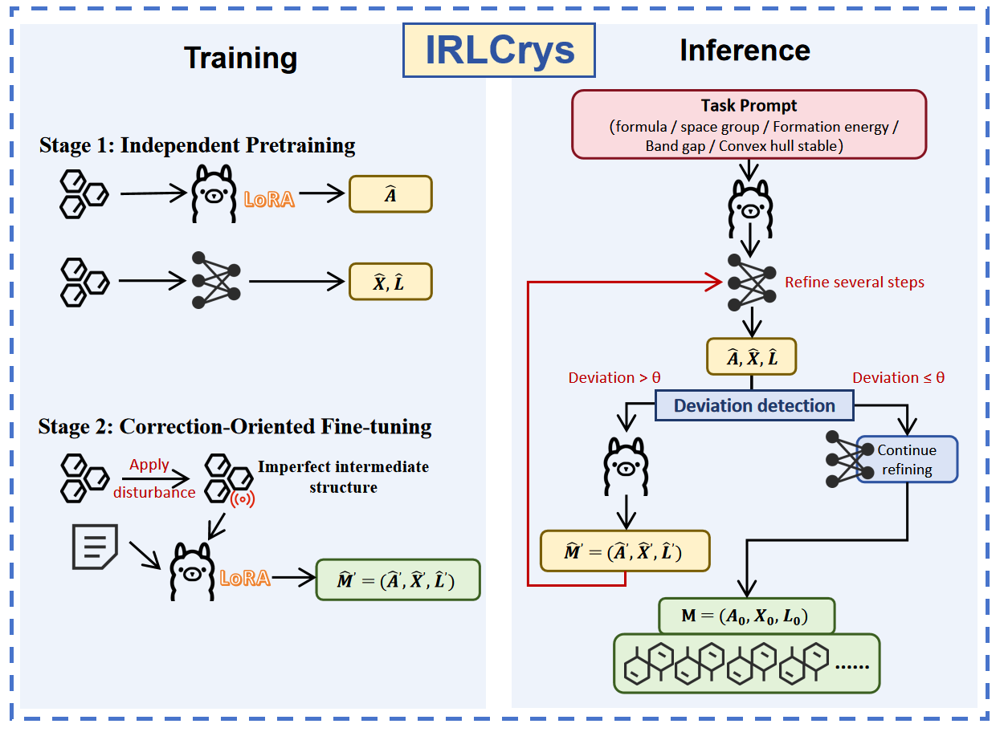

# IRLCrys: Iterative Reasoning with LLM for Multi-Conditional Crystal Structure Generation

[](https://github.com/Cynthia1505/IRLCrys)

This repository contains the official code release for our paper [*"IRLCrys: Iterative Reasoning with LLM for Multi-Conditional Crystal Structure Generation"*], 


IRLCrys introduces an **iterative reasoning** paradigm that repositions the LLM from a one-shot generator to a **condition-aware reasoner**, effectively maintaining multi-conditional constraints throughout the entire diffusion/flow-matching refinement process. Key contributions of IRLCrys are:
- **Iterative Reasoning Loop**: The LLM continuously observes intermediate structures, reasons about deviations from target conditions (composition, space group, formation energy, band gap), and outputs corrective guidance at each key refinement step.
- **Correction-Oriented Fine-Tuning (Stage 2)**: A second-stage fine-tuning equips the LLM with structural repair capability, enabling it to correct both continuous variable deviations and atomic composition errors.
- **Adaptive Deviation Detection**: During inference, lightweight neural surrogate predictors (CHGNet, ALIGNN) detect deviations in real-time, triggering LLM corrections only when necessary (lightweight for coordinates, heavyweight for atom types).
- **Order-of-Magnitude PMR Improvement**: On the MP-20 dataset, IRLCrys achieves nearly an order-of-magnitude improvement in Property Match Rate (PMR) under four simultaneous physical constraints compared to prior hybrid frameworks (FlowLLM, CrysLLMGen).
- **Generalizable Paradigm**: Extends the "state observation → deviation reasoning → corrective guidance" paradigm from linguistic tasks to structured scientific generation.

<p align="center">
  
</p>


## Installation

The list of dependencies is provided in the `requirements.txt` file. You can install all dependencies through the following commands:

```bash
bash install.sh
# or manually:
pip install -r requirements.txt
```

**Note**: If you encounter any missing packages, please install them manually using `pip install <package>`.

### Data Preparation (MP-20)

We do **not** redistribute the MP-20 dataset directly in this repository due to file size and licensing restrictions. The MP-20 dataset is publicly available via the **Materials Project**.

To automatically download and preprocess the dataset, please run:

```bash
python scripts/download_mp20.py
```

This script uses the official MP API (`mp_api`) to fetch all structures with ≤20 atoms per cell. Alternatively, you can download the raw data manually from the [Materials Project website](https://materialsproject.org/).


## Usage Guide

### Training Pipeline

IRLCrys adopts a two-stage training strategy.

#### Stage 1: Fine-tune LLaMA (Condition-Aware Generation)

First, fine-tune the LLM backbone (LLaMA-2-7B or LLaMA-3.1-70B) to generate initial crystal structures conditioned on physical property prompts.

**For MP-20**

```bash
python -W ignore llm_finetune.py \
--run-name 7b-mp \
--model 7b \
--num-epochs 1 \
--data-path data/mp_20 \
--learning-rate 1e-4 \
--batch-size 128
```

**Output**: The fine-tuned LLM checkpoint will be saved in:
* `exp/7b-mp/checkpoint-xxxxx/` (MP-20)


#### Stage 2: Correction-Oriented Fine-Tuning

Build the correction training data by perturbing target structures (adding Gaussian noise to coordinates/lattice and optionally replacing atom types).

```bash
python -W ignore stage2_data_builder.py \
--data-path data/mp_20 \
--output-path data/mp_20_correction \
--num-perturbs 5
```

Then, fine-tune the Stage-1 LLM on this correction data to equip it with structural repair capability:

```bash
python -W ignore stage2_finetune.py \
--base-model exp/7b-mp/checkpoint-xxxxx \
--data-path data/mp_20_correction \
--run-name 7b-mp-stage2 \
--num-epochs 3 \
--learning-rate 5e-5
```

**Output**: The Stage-2 fine-tuned LLM will be saved in:
* `exp/7b-mp-stage2/checkpoint-xxxxx/`


#### Train the Refinement Module (Diffusion / Flow Matching)

Train the equivariant refinement module (DiffCSP or FlowMM) on the MP-20 dataset.

```bash
python -W ignore diff_train.py \
--dataset mp_20 \
--batch_size 512 \
--epochs 500 \
--timesteps 1000 \
--run-type train
```

**Output**: The trained refinement module will be saved at:
```
out/mp_20/<expt_date>/<expt_time>/
```


### Inference with Iterative Reasoning (IRLCrys Sampling)

Use the trained Stage-2 LLM and the refinement module to perform iterative reasoning generation. The LLM will intervene whenever the current intermediate structure deviates from the target conditions.

**Basic Command**

```bash
python -W ignore irlcrys_sample.py \
--llm_path exp/7b-mp-stage2/checkpoint-xxxxx \
--refine_path out/mp_20/<expt_date>/<expt_time>/ \
--num_samples 10000 \
--dataset mp \
--max_steps 200 \
--temp 1.0 \
--top_p 0.7 \
--batch_size 128 \
--out_prefix "IRLCrys_sample"
```

**Key Parameters Explained**:

| Parameter | Description |
| :--- | :--- |
| `--llm_path` | Path to the Stage-2 fine-tuned LLM checkpoint. |
| `--refine_path` | Path to the trained refinement module (diffusion/flow matching). |
| `--max_steps` | Maximum number of refinement steps (default: 200). |
| `--temp` | Sampling temperature for LLM generation (default: 1.0). |
| `--top_p` | Nucleus sampling threshold (default: 0.7). |
| `--theta_ef` | Deviation threshold for formation energy (default: 0.1 eV/atom). |
| `--theta_eg` | Deviation threshold for band gap (default: 0.5 eV). |
| `--delta_reset` | Reset step size after heavy-weight correction (default: 20). |

**Output**: Generated samples are saved as `.pt` files:
* `IRLCrys_sample_mp_10000.pt`


### Evaluation

#### 1. Compute Property Match Rate (PMR)

Property Match Rate (PMR) will be automatically calculated and printed at the end of IRLCrys Sampling.

#### 2. Stability & Novelty Analysis

Perform CHGNet-based structural relaxation and compute energy above hull (`E^hull`), then evaluate novelty against the training/validation sets using StructureMatcher.

```bash
python -W ignore eval_stability_novelty.py \
--sample_path IRLCrys_sample_mp_10000.pt \
--train_path data/mp_20/train.csv \
--val_path data/mp_20/val.csv
```

#### 3. Plot PMR Trajectory

Visualize the sawtooth-shaped PMR trajectory during iterative refinement (as shown in Figure 5 of the paper).

```bash
python -W ignore plot_pmr_trajectory.py \
--log_path logs/irlcrys_trajectory.log \
--output_path pmr_trajectory.png
```


### Reproducing Baseline Comparisons

To reproduce the baseline results for CrysLLMGen and FlowLLM reported in Table 1, please refer to their official repositories:

- **CrysLLMGen**: [https://github.com/kdmsit/crysllmgen](https://github.com/kdmsit/crysllmgen)
- **FlowLLM**: [https://github.com/facebookresearch/flowllm](https://github.com/facebookresearch/flowllm)

We used the same evaluation protocol (same prompts, same neural surrogate predictors) for all methods to ensure fair comparison.


## Repository Structure

```
IRLCrys/
├── README.md                    # This file
├── requirements.txt             # Python dependencies
├── install.sh                   # One-click installation script
├── LICENSE                      # Apache 2.0 License
│
├── configs/
│   └── config.py                # Global configuration
│
├── src/
│   ├── constants.py             # Atomic constants, MP-20 stats
│   ├── enc_dec.py               # Crystal ↔ Text (CIF) bidirectional conversion
│   ├── data_utils.py            # Data loading & preprocessing
│   ├── utils.py                 # Generic helper functions
│   ├── verify_tools.py          # Physical validity checks
│   ├── templating.py            # Prompt template construction
│   ├── llm_finetune.py          # Stage 1 LLM fine-tuning
│   ├── stage2_data_builder.py   # Stage 2 correction data construction
│   ├── stage2_finetune.py       # Stage 2 correction-oriented fine-tuning
│   ├── diff_refinement.py       # Equivariant refinement module
│   └── irlcrys_sample.py        # ★ Core: iterative reasoning inference
│
├── evaluation/
│   ├── eval_stability_novelty.py# Stability & novelty analysis
│   └── plot_pmr_trajectory.py   # PMR trajectory plotting
│
├── scripts/
│   └── download_mp20.py         # MP-20 data download via Materials Project API
│
└── samples/
    └── example_output.cif       # Example generated crystal structures
```
